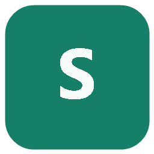

<p align="center">
  
</p>

<h1 align="center">Share Master</h1>

<p align="center">
  一个工作区，连接 Codex、Claude、DeepSeek、Qwen 与 OpenAI 兼容模型。
</p>

<p align="center">
  <a href="https://github.com/MttJelly/share-master/releases/latest"></a>
  
  
  
</p>

Share Master 是一款面向 Windows 的多模型桌面客户端。不同模型共享 Share Master 自己的本地会话记录，同时保持账号、连接和原始客户端数据相互独立。

> [!IMPORTANT]
> Share Master 使用独立数据目录。读取本机 Codex、Claude Code 或 CCSwitch 配置与聊天记录时采用只读方式，不会修改原始客户端文件。

## 下载

| 版本 | 下载 | 适用场景 |
| --- | --- | --- |
| ZIP 便携版 | [下载 `Share-Master-0.1.0-portable-win-x64.zip`](https://github.com/MttJelly/share-master/releases/download/v0.1.0/Share-Master-0.1.0-portable-win-x64.zip) | 免安装，解压后运行 `Share Master.exe` |
| MSI 安装版 | [下载 `Share-Master-0.1.0-setup-win-x64.msi`](https://github.com/MttJelly/share-master/releases/download/v0.1.0/Share-Master-0.1.0-setup-win-x64.msi) | 标准安装，包含桌面快捷方式和卸载入口 |

<p align="center">
  <a href="https://github.com/MttJelly/share-master/releases">查看全部版本与更新说明</a>
</p>

## 功能概览

| 模型与会话 | 工作流与效率 |
| --- | --- |
| **多模型连接**<br>支持 Codex、Claude Code、DeepSeek、Qwen 和自定义 OpenAI 兼容接口 | **多会话并行**<br>切换到其他会话后，当前回复继续在后台运行 |
| **共享聊天记录**<br>在同一份 Share Master 会话中切换模型和连接 | **消息控制**<br>支持停止、引导当前回复、排队发送和完成通知 |
| **多账号管理**<br>独立管理官方账号、API、中转站、模型和密钥 | **Project 工作区**<br>支持项目分组、多窗口、搜索、归档、移除和恢复 |
| **连接可靠性**<br>提供健康检查、故障转移、用量统计和价格配置 | **已安排任务**<br>支持一次、每小时、每天、工作日、每周和每月执行 |
| **本地配置发现**<br>只读发现 Codex、Claude Code 与 CCSwitch 的现有配置 | **附件与扩展**<br>支持图片拖放、消息引用、`/` Skill、Prompt 和 MCP |
| **本地记录浏览**<br>只读查看并单向复制 Codex 与 Claude 会话 | **备份与同步**<br>支持本地目录和 WebDAV，同步时排除密钥与聊天正文 |

## 首次使用

1. 启动 Share Master，在“选择连接方式”中选择官方账号或添加 API 连接。
2. 使用 Codex 时需先安装 Codex CLI，并确保终端可以运行 `codex`。
3. 使用 Claude 时需先安装 Claude Code CLI，并确保终端可以运行 `claude`。
4. 使用 DeepSeek、Qwen 或其他兼容服务时，填写 Base URL、模型名称和 API Key。
5. API Key 使用 Windows 安全存储加密，只保存在当前电脑的 Share Master 数据目录中。

## 数据与隐私

安装版和 ZIP 版默认把私有配置与聊天副本保存在：

```text
%APPDATA%\Share Master\data
```

发布包和配置导出文件不会包含：

- API Key、Token、登录凭据或 Windows 安全存储数据。
- Share Master 私有聊天记录。
- Codex、Claude Code 或 ChatGPT 原始聊天记录。
- 本机测试数据、日志或用户路径配置。

删除软件不会自动删除 `%APPDATA%\Share Master`。如需彻底清理，请在卸载并备份所需会话后手动删除该目录。

## 开发

<details>
<summary><strong>本地运行</strong></summary>

需要 Node.js 20 或更高版本。

```powershell
npm install
npm start
```

使用项目内隔离数据目录：

```powershell
& '.\Start Share Master.cmd'
```

</details>

<details>
<summary><strong>构建 Windows 发布包</strong></summary>

```powershell
npm install
npm run dist:win
```

生成文件位于 `release` 目录。

</details>

<details>
<summary><strong>运行测试</strong></summary>

```powershell
npm run check
npm run test:unit
npm run test:vue-ui
npm run test:project-actions
npm run test:multi-window
```

</details>

## 隐私边界

Share Master 是独立应用，只复用当前电脑上已安装的 CLI 或用户明确导入的配置。它不会修改原始 ChatGPT App、Codex、Claude Code 或 CCSwitch 的程序文件，也不会删除或覆盖这些客户端的原始聊天记录。
