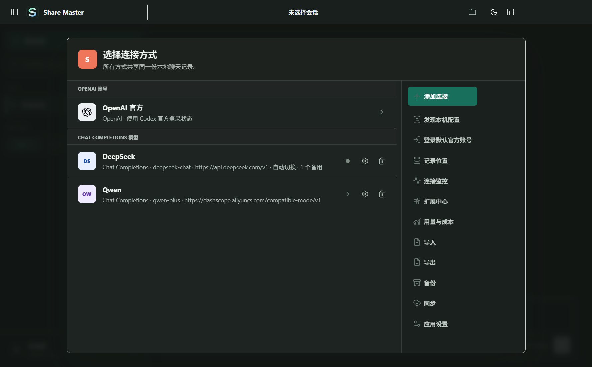
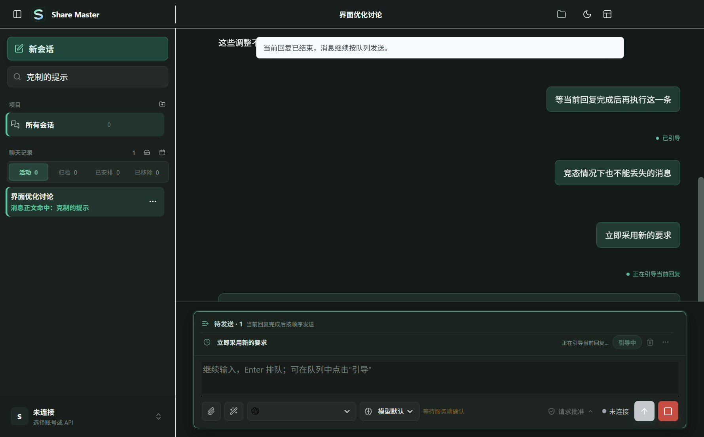

<h1 align="center">Share Master</h1>

<p align="center">
  <strong>把模型、会话和工作流放进同一个 Windows 工作台</strong>
</p>

<p align="center">
  在一份连续的本地会话中连接 Codex、Claude Code、DeepSeek、Qwen<br />
  以及 OpenAI 兼容服务，同时管理项目、任务、附件、Skills 与并行回复。
</p>

<p align="center">
  <a href="https://github.com/MttJelly/share-master/releases/latest"></a>
  
  
  
</p>

<p align="center">
  <a href="https://github.com/MttJelly/share-master/releases/latest/download/Share-Master-portable-win-x64.zip"><strong>下载 ZIP 便携版</strong></a>
  &nbsp;&nbsp;·&nbsp;&nbsp;
  <a href="https://github.com/MttJelly/share-master/releases/latest/download/Share-Master-setup-win-x64.msi"><strong>下载 MSI 安装版</strong></a>
  &nbsp;&nbsp;·&nbsp;&nbsp;
  <a href="docs/USER_GUIDE.zh-CN.md"><strong>中文使用指南</strong></a>
</p>

---

## 产品界面

<p align="center">
  
</p>
<p align="center"><sub>统一管理账号、API、中转服务、模型和连接状态</sub></p>

<p align="center">
  
</p>
<p align="center"><sub>在回答期间继续输入，通过排队或引导控制下一步工作</sub></p>

## 一个工作区，持续完成工作

Share Master 是面向 Windows 的多模型桌面客户端。你可以在同一个 Project 中保留完整上下文，按任务选择不同模型；切换会话时，正在运行的回答继续在后台完成。每个连接独立管理，Share Master 的会话、队列和任务统一保存在自己的数据目录中。

## 核心体验

| | 能力 | 你可以做什么 |
| --- | --- | --- |
| **01** | **共享会话** | 在同一份 Share Master 会话中切换连接与模型，不必反复搬运上下文 |
| **02** | **并行工作** | 当前回答在后台继续运行，同时打开其他会话或独立窗口处理新任务 |
| **03** | **消息控制** | 连续输入消息，选择排队发送或立即引导当前回答，并随时停止生成 |
| **04** | **Project 管理** | 按项目组织会话，自动按最近活动排序，支持搜索、归档、移除与恢复 |
| **05** | **多模型连接** | 管理官方账号、API、中转服务、模型列表、健康检查、故障转移与用量 |
| **06** | **完整输入** | 拖放、选择或粘贴图片附件，通过 `/` 使用 Skills，并连接 Prompt 与 MCP |
| **07** | **任务安排** | 创建一次、每小时、每天、工作日、每周或每月执行的自动任务 |
| **08** | **本地协作** | 浏览本机 Codex 与 Claude Code 会话，并按需复制到 Share Master 工作区 |

## 多端协同目标

Share Master 当前提供 Windows x64 版本。下一阶段的产品目标是让同一个账号、Project 和聊天记录可以在 Windows、macOS、Linux 与手机之间安全衔接，而不是简单同步正在写入的本地数据库。

| 平台与基础能力 | 当前状态 | 优化目标 |
| --- | --- | --- |
| **Windows** | 已支持 | 持续优化性能、稳定性、通知和后台多会话 |
| **macOS** | 规划中 | 提供原生安装包、系统通知、菜单栏与安全存储适配 |
| **Linux** | 规划中 | 提供主流发行版安装包与桌面环境适配 |
| **手机端** | 规划中 | 优先实现会话查看、继续发送、附件和任务通知 |
| **多端同步** | 设计中 | 使用端到端加密的增量事件同步，合并消息、Project 与附件 |

多端版本将保持模型连接和本地工具的能力边界：桌面端负责需要本机环境的任务，其他设备可以安全查看上下文、继续会话并接收运行结果。

## 下载与安装

| 发行包 | 使用方式 | 下载 |
| --- | --- | --- |
| **ZIP 便携版** | 解压后运行 `Share Master.exe`，适合免安装使用 | [下载最新便携版](https://github.com/MttJelly/share-master/releases/latest/download/Share-Master-portable-win-x64.zip) |
| **MSI 安装版** | 标准 Windows 安装，包含桌面快捷方式和卸载入口 | [下载最新安装版](https://github.com/MttJelly/share-master/releases/latest/download/Share-Master-setup-win-x64.msi) |

每个 Release 同时提供带版本号的安装包、稳定下载文件名和 SHA-256 清单。历史版本与完整更新内容可在 [Releases](https://github.com/MttJelly/share-master/releases) 查看。

## 开始使用

1. 安装 MSI，或解压 ZIP 便携版。
2. 打开 Share Master，在“连接方式”中选择现有账号或添加 API 服务。
3. 新建 Project 和会话，选择模型后开始聊天。
4. 在模型回复期间继续输入，按需要排队、引导或切换到其他会话。

API Key 和 Token 只需在对应连接中保存一次。之后可以直接选择该连接，Share Master 不会把密钥写入聊天正文、配置导出或发布包。

## 工作区能力

<table>
  <tr>
    <td width="50%" valign="top">
      <h3>对话与模型</h3>
      <p>共享聊天记录、多会话并行、模型切换、推理强度、流式回复、中断、重新生成、引用与分支。</p>
    </td>
    <td width="50%" valign="top">
      <h3>输入与队列</h3>
      <p>连续输入、待发送队列、即时引导、图片附件、拖放与剪贴板粘贴，以及完成后的系统通知。</p>
    </td>
  </tr>
  <tr>
    <td width="50%" valign="top">
      <h3>连接与配置</h3>
      <p>多账号、多供应商、模型发现、连接测试、用量与价格、故障转移，以及本机配置只读发现。</p>
    </td>
    <td width="50%" valign="top">
      <h3>组织与自动化</h3>
      <p>Project、会话搜索、归档与恢复、多窗口、已安排任务、Skills、Prompt、MCP、备份和 WebDAV。</p>
    </td>
  </tr>
</table>

## 数据位置

Share Master 默认将自己的配置与聊天数据保存在：

```text
%APPDATA%\Share Master\data
```

本机配置发现和本地记录浏览采用只读方式。Share Master 不会修改其他客户端的程序文件，也不会删除或覆盖其原始聊天记录。卸载 Share Master 不会自动删除上述数据目录，迁移或清理前请先备份所需会话。

## 文档

| 文档 | 内容 |
| --- | --- |
| [中文使用指南](docs/USER_GUIDE.zh-CN.md) | 安装、连接、会话、附件、任务、同步与故障排查 |
| [English User Guide](docs/USER_GUIDE.en.md) | Complete English setup and usage guide |
| [更新日志](CHANGELOG.md) | 每个版本的新增、优化与修复 |
| [发布维护流程](docs/RELEASE_PROCESS.md) | 版本、测试、构建与发布规范 |

## 本地开发

需要 Node.js 20 或更高版本。

```powershell
npm install
npm start
```

使用仓库内的隔离数据目录运行：

```powershell
& '.\Start Share Master.cmd'
```

构建 Windows ZIP 和 MSI：

```powershell
npm run dist:win
```

基础验证：

```powershell
npm run check
npm run test:unit
npm run test:vue-ui
```
